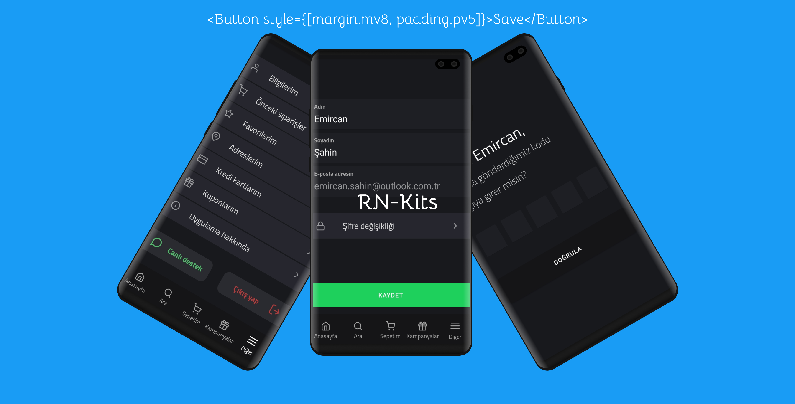

# Freppex-React-Native-Utilities
Kendi yaptığım bir React-Native çerçevesidir. Bir component'i kişileştirmek için kullanılır.

# Ne İçin Kullanılır?
Biliyorsunuz ki React-Native'de web gibi yeni bir style dosyasına kişileştirmeler yazılır. Fakat projelerin daha hızlı geliştirilmesi amacıyla artık style içerisinde kişileştirilmeler yapılıyor. Bunun için bende react-native için bir utilities(araçlar) yazdım. Bunun sayesinde kolayca uygulamalar yapabilirsiniz.

# NOT:
Örneklerde özel font, iconlar vs. eklenmiştir. Bunların paketlerini yükleyebilir veya kaldırabilirsiniz.

# Örnekler - Examples:

